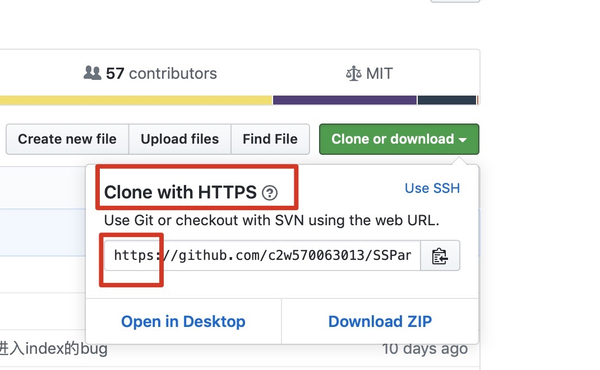

##Git Clone From Github
### Speed up the clone on a proxy-terminal
If you are using proxy on terminal and trying to clone a repository
from github, it's better to use 'Clone with Https' than 'Clone with
SSH'. Cause SSH didn't through the proxy on terminal which
means the clone speed is extremely slow.

