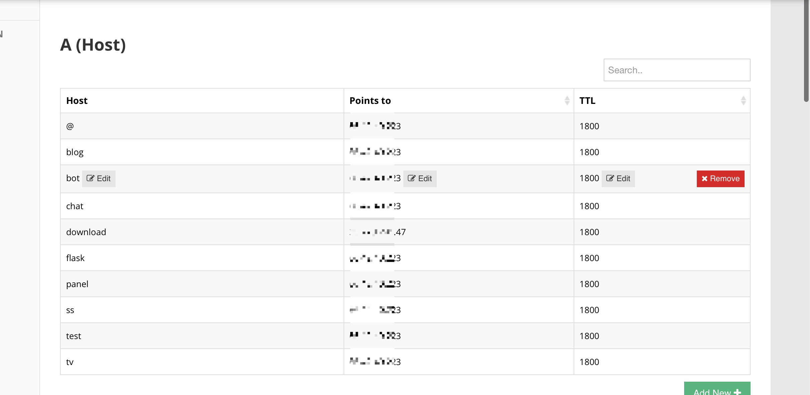
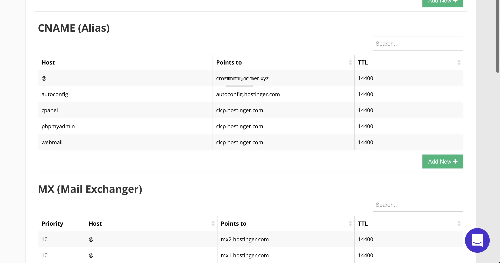

take attention when configure your domain dns.

> '@' means your domain. and you can also replace it with your real domain name but it will convert to '@' finally.

>notice: if you want www.your-domain can be redirected to your-domain. 
>you should configure both 'www.your-domain.conf' and 'your-domain.conf' point to the same project.

latest:

