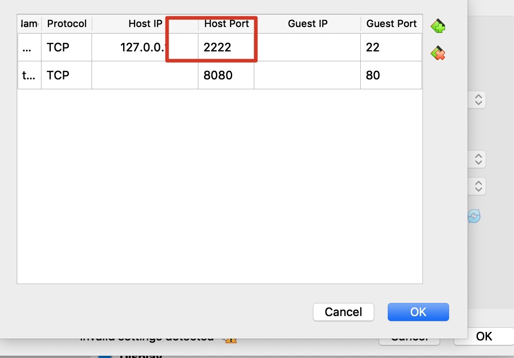

## Connect to vagrant mysql from host.
1.setting vagrant root password(debian)
```shell script
sudo -i
passwd root
```
2.checkout vagrant network port forwarding




3.connect to vagrant mysql with ssh


