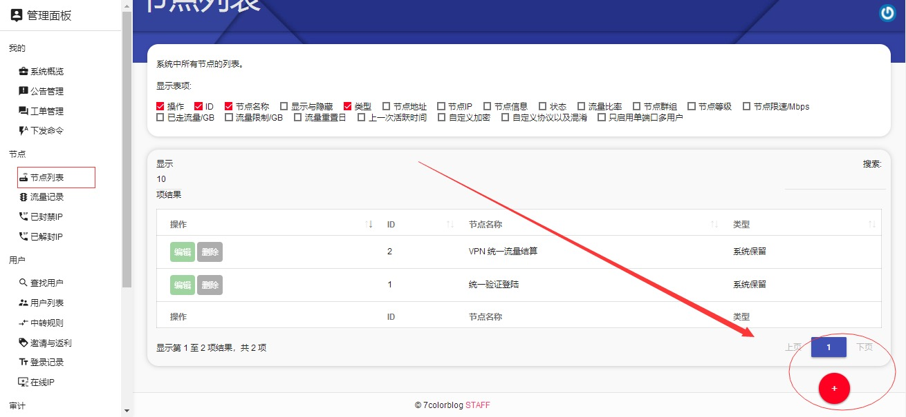
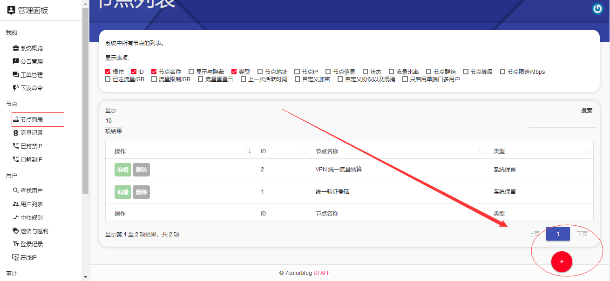
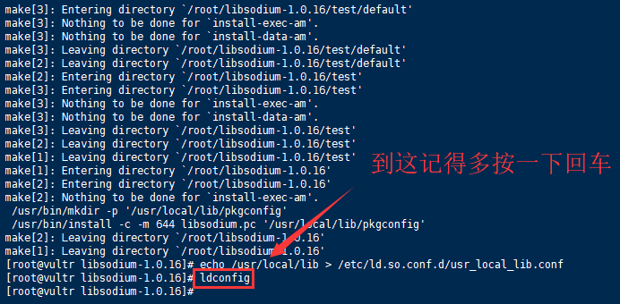
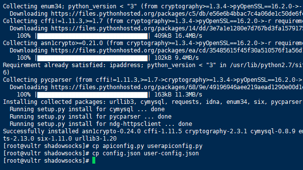
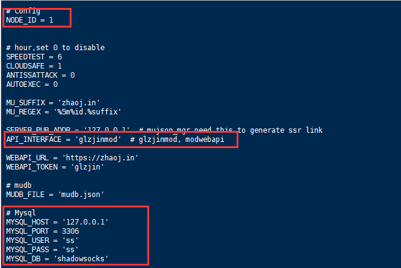
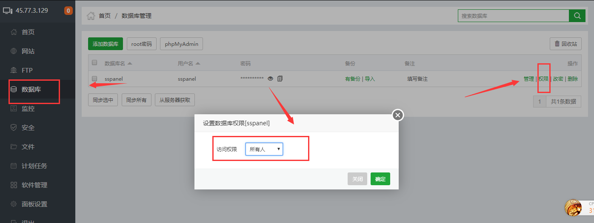
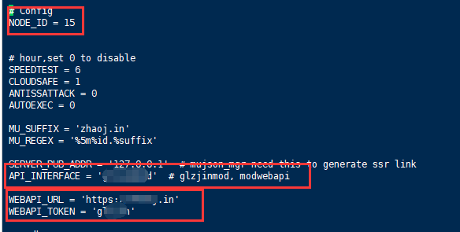
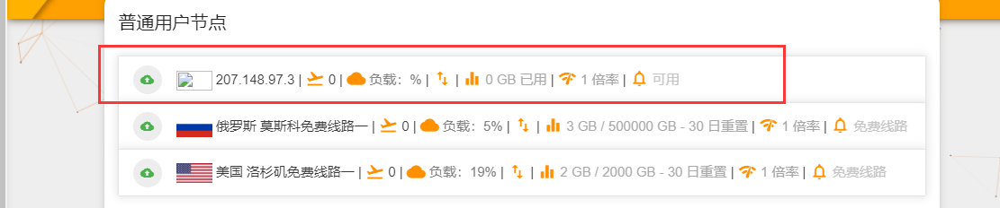

## sspanelv3魔改后端手动对接(备份)
>原文地址:https://www.7colorblog.com/?id=35

 前两天写了一个后端对接的一键脚本：sspanelv3魔改后端部署一键脚本   发现有的朋友用一键脚本安装不上，今天开个贴，写一个手动对接的教程
 
 ### 准备
 我们先需要在sspanel的前端创建一个节点，在“管理面板”的“节点列表”菜单中，点击“加号”
 
 
 
 
 
节点名称自己取；<br>
节点地址填节点的ip，注意是节点的ip；<br> 
节点ip填节点的ip，注意是节点的ip；<br> 
流量比例默认是1<br>

是否显示要选中，不然前端不显示；<br>
节点状态自己写；<br>
节点描述自己写；<br>
节点等级，大于等于这个数字的用户才能使用这个节点；<br>
节点群组，非本群组的用户不能使用；<br>
节点流量上限自己按需定；<br>
节点流量上线清空日自己定；<br>
节点限速自己定；<br>

然后我们连接到后端节点的vps<br>
 
### 对接节点
第一步我们先安装libsodium：
```shell script
yum -y groupinstall "Development Tools"
wget https://download.libsodium.org/libsodium/releases/libsodium-1.0.16.tar.gz
tar xf libsodium-1.0.16.tar.gz && cd libsodium-1.0.16
./configure && make -j2 && make install
echo /usr/local/lib > /etc/ld.so.conf.d/usr_local_lib.conf
ldconfig
```
libsodium是给SSR提供chacha20、salsa20、chacha20-ietf等高级加密所必须的扩展库，我们复制上方代码执行。
<br>稍微等待一会儿。。。出现如下提示



第二步我们安装后端：
```shell script
cd /root
yum -y install python-setuptools
easy_install pip
git clone -b manyuser https://github.com/lizhongnian/shadowsocks.git
cd shadowsocks
pip install -r requirements.txt
cp apiconfig.py userapiconfig.py
cp config.json user-config.json
```
复制上方代码执行。出现如下提示



后端安装完成后，需要我们手动去修改配置文件
```shell script
vi userapiconfig.py
```
这里推荐两种对接方式，二选一：

第一种：数据库对接



上图所示画红色框的地方是必填项

NODE_ID = 这里输入前端的节点ID

API_INTERFACE = 'glzjinmod' 务必选择glzjinmod

Mysql下面填写前端的MySQL数据库信息

请注意：此处需要放开数据库的远程连接权限，宝塔用户如下图：



第二种：webapi对接



如上图

NODE_ID = 这里输入前端的节点ID

API_INTERFACE = 'modwebapi' 务必选择modwebapi

WEBAPI_URL = 'http://ss.7color.tk'  这里需要把地址改成前端地址，务必区分http和https

WEBAPI_TOKEN='7colorblog.com' 这里需要改为前端配置文件里的mukey


二选一按照上面的方法修改，我们接下来开启后端测试一下：
```shell script
python server.py
```
复制执行。

我们回到前端节点列表看一下节点是否在线



前边的图标显示绿色就是在线了


回到后端，按下ctrl+c

然后复制执行下方语句
```shell script
./run.sh
```